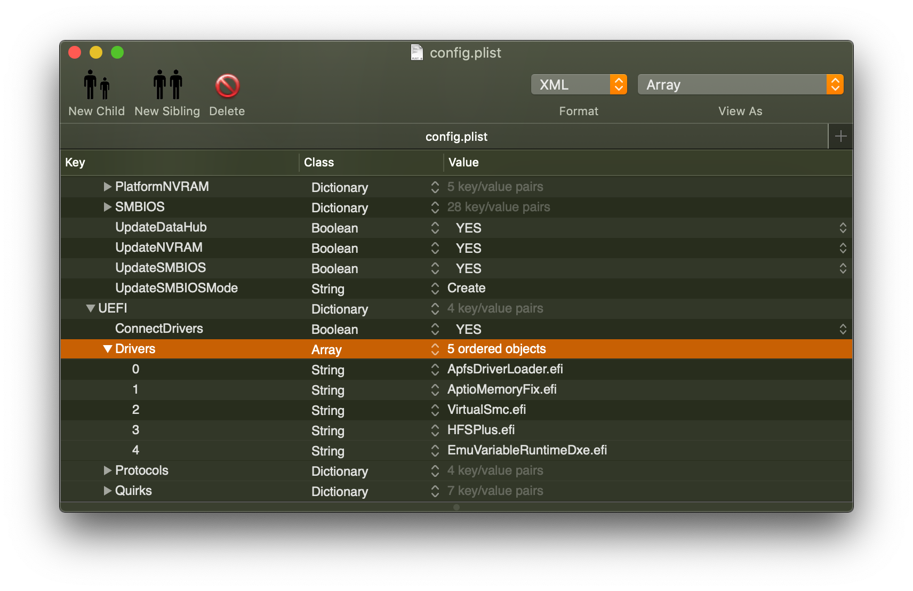

# 更新记录
- 最近更新: 2019.11.15 
- 本文最开始写的时候是 OpenCore 0.03 版本, 到现在已经变化了不少.
- 建议下载最新的 OpenCore 开始, 并留意我的注释
- OpenCore 0.04 版本开始, 有比较大的变化:
    - AptioMemoryFix.efi 已经弃用, 功能移到了 OpenCore/config.plist/Booter 
    - FwRuntimeServices.efi 取代了 VariableRunEmutimeDxe.efi 和 EmuVariableRuntimeDxe.efi. 
    - 但总体结构上保持一致.
- OpenCore 0.5 版本开始公测
    - 尝试模拟白苹果行为, 比如按住CMD+R的同时开机, 进入恢复模式, 等等.

# 资源:

1. OpenCore 的官方下载地址: [OpenCore](https://github.com/acidanthera/OpenCorePkg)
2. 与 OpenCore 配合使用的 kexts, efi 下载地址: [kexts](https://github.com/acidanthera/OpenCorePkg/blob/master/Docs/Kexts.md)
3. OpenCore 的文档很细致, 下载后解压, 阅读 `Docs/Configuration.pdf` 
4. 请勿使用来自 Clover 的 kexts, 他们并不兼容.

# Wiki
[wiki](https://github.com/cattyhouse/oc-guide/wiki) 会放一些OpenCore使用过程中的一些经验

# 关于本文
- ***通篇没有废话, 请务必认真读每一个字*** 
- 尽可能用最简单的语言描述OpenCore安装和启动黑苹果.
- 不提供最终的启动文件,而是提供方法.有了正确的方法, 就可以完全掌控自己的电脑.
- 黑苹果用到的所有工具,kexts以及efi文件的链接都指向原作者,可以及时的了解原作者的更新内容, 同时确保看到这篇文章的时候, 使用的是最新.
- 建议通读本文并理解后,再开始黑苹果之旅.

# 黑苹果与白苹果的主要区别
> 2006年乔布斯将苹果电脑使用的处理器从IBM转向Intel之后, 在普通PC上安装macOS的大门才算正式开启, 随着硬件的发展, PC与苹果电脑的差异越来越小, 黑苹果越来越接近苹果电脑, 目前的区别主要在于EFI以及ACPI.
- EFI
    - Bootloader所在的分区, [OpenCore](https://github.com/acidanthera/OpenCorePkg), Clover等都安装在这里. 苹果电脑则是采用私有的bootloader
    - 分区格式为FAT32, 所以Windows, Linux, macOS等等都可以读写这个分区的文件
    - OpenCore可以放在SSD的EFI分区里, 也可以放在FAT32格式的USB盘上, 建议调试阶段使用USB盘,调试完毕复制到SSD的EFI分区

- ACPI
    - ACPI是保存在BIOS里面的描述硬件的一张表
    - PC与苹果电脑的ACPI内容大致一样,但也有不少的区别,这些少量区别足以导致一个原生的macOS安装盘在PC上启动失败.
    - OpenCore作为一个booloader,除了负责启动macOS之外的另一个主要功能就是修改PC的ACPI表兼容macOS

> 所以接下来的内容就非常明了:
- 制作一个macOS启动U盘, 直接采用苹果官方提供的方法.
- 生成一个OpenCore的EFI放在U盘, 将macOS安装到PC并启动
- 复制U盘上的EFI到安装好macOS的SSD上, 从SSD启动macOS, 脱离U盘.

# OpenCore的优缺点

## 优点
- 结构非常简单,没有安装文件pkg,跟搭积木一样简单,就算没有任何黑苹果经验, 也很容易上手
- 体积非常小, 只有9k的`BOOTx64.efi`启动文件和~200KB的`OpenCore.efi`主文件
- 速度非常快
- 文档非常完善,每一个配置都有详尽的说明
- 全新的Bootloader, 没有历史包袱
- 稳定, 非常稳定
- 安全, 可以选择对自身做签名,防止篡改
- 配置文件有严格的一一对应的要求, 知道自己在干什么.

## 缺点
- 目前处于开发阶段, 更新会比较勤, 变动可能会比较大, 不过作者会做详细的变动记录,文档都及时更新
- ~~Clover的某些功能在OpenCore上面缺失, 不过目前的功能完全够用~~ 现在 OpenCore 比 Clover 强大很多

# 制作 macOS 启动U盘

> 以下方法来自苹果官网
> 需要在 macOS 上操作, 如果没有 macOS 请看下面 **最简单的安装macOS的方法**
- 从 App Store 下载 macOS
    - 如果下载失败, 可以考虑使用这个[gibMacOS](https://github.com/corpnewt/gibMacOS) 下载各种版本的 macOS, 可以在任意操作系统下面操作.
- [格式化U盘](https://support.apple.com/zh-cn/HT208496)
    - 建议16GB容量, 使用macOS的磁盘工具格式化
    - 选择`GUID分区表`以及`Mac OS 扩展格式`
    - 启动盘U盘一定要使用`Mac OS 扩展格式`, 否则后面的步骤无法操作
- [创建启动盘](https://support.apple.com/zh-cn/HT201372)

# 挂载U盘的EFI分区
> 挂载EFI分区,供安装OpenCore使用
- macOS下的方法, 打开终端.app, 执行以下命令
    - 确定EFI所在的位置
        ```sh
        diskutil list | grep -A4 external
        ```
    - 输出结果举例, EFI在 `disk4s1`
        ````
          1:   EFI EFI   209.7 MB   disk4s1
        ````
    - 挂载EFI分区, 完成后桌面会出现一个名为EFI空分区, 所有的Opencore的操作都在这个EFI分区的EFI文件夹下面进行
        ```sh
        sudo diskutil mount /dev/disk4s1
        ```

# 最简单的安装macOS的方法

> 此为无需制作启动盘的安装方法, 可以在任意操作系统下面操作.

> 此方法源自OpenCore的文档, 需要先配置好OpenCore, 然后用它来启动Recovery的DMG.有兴趣的可以继续看:

> [OpenCore从Recovery的DMG安装macOS各种版本](oc-dmg-install.md)

# OpenCore安装与配置

## OpenCore的文件结构

> 首先, 我们看看一个已经配置好的 OpenCore v0.03 的文件结构, 在 EFI 分区 (/Volumes/EFI/) 下面, 有一个 EFI 文件夹, 内容如下

````
括号里面为我的注释

EFI
│   ├── BOOT
│   │   └── BOOTx64.efi
│   └── OC
│       ├── ACPI
│       │   ├── SSDT-PLUG.aml (注意看里面的 CPU 名称, 根据 DSDT 里面的 CPU 名称做相应的修改, 比如 PR.PR00, SB.PR00, PR.CPU0 等等)
│       ├── Drivers
│       │   ├── ApfsDriverLoader.efi 
│       │   ├── AptioMemoryFix.efi (新版本 OpenCore 已经弃用此 efi, 通过 config.plist/Booter 里面的选项提供此功能)
│       │   ├── EmuVariableRuntimeDxe.efi (新版本 OpenCore 已经用 FwRuntimeServices.efi 取代 )
│       │   ├── HFSPlus.efi
│       ├── Kexts
│       │   ├── AppleALC.kext
│       │   ├── IntelMausiEthernet.kext
│       │   ├── Lilu.kext
│       │   ├── SMCProcessor.kext
│       │   ├── SMCSuperIO.kext
│       │   ├── VirtualSMC.kext
│       │   └── WhateverGreen.kext
│       ├── OpenCore.efi
│       ├── Tools
│       │   ├── CleanNvram.efi (已经弃用, 设置 config.plist AllowNvramReset=YES/True 启用 Reset Nvram 的功能)
│       │   └── Shell.efi
│       └── config.plist

````

> 简单说明如下

- `EFI/BOOT/BOOTx64.efi` 电脑启动的时候读取的引导文件, 前面说过, 只有9KB
- `EFI/OC` OpenCore存放目录
    - `ACPI` 存放自定义的ssdt aml文件, 比如
        - [`SSDT-PLUG.aml`](EFI/OC/ACPI/SSDT-PLUG.aml) 开启硬件变频功能, 作用于CPU, iGPU, dGPU.
        - [`SSDT-AWAC.dsl`](https://github.com/acidanthera/OpenCorePkg/tree/master/Docs/AcpiSamples) 300系列的主板用最近更新的 BIOS 后, RTC 失效, 这个 SSDT 作用是启用 RTC, 需要自行编译为 aml
        - [`SSDT-EC-USBX.dsl`](https://github.com/acidanthera/OpenCorePkg/tree/master/Docs/AcpiSamples) Fake EC 和 USBX, 给 macOS 提供一个虚假的EC设备, 同时提供 USB 大电流支持, 需要自行编译为 aml
    - `Drivers` 存放文件系统驱动文件, 比如
        - [`ApfsDriverLoader.efi`](https://github.com/acidanthera/AppleSupportPkg/releases) 用于加载macOS内置的apfs.efi,读取APFS分区
        - ~~[`AptioMemoryFix.efi`](https://github.com/acidanthera/AptioFixPkg/releases) fix BIOS firmware, 让macOS可以正确启动,~~ (新版本 OpenCore 已经弃用此 efi)
        - ~~[`EmuVariableRuntimeDxe.efi`](EFI/OC/Drivers/EmuVariableRuntimeDxe.efi) 大部分100/200/300系列的主板的nvram无法被macOS访问, 这个efi提供一个模拟的nvram, Justin从[UDK 2018](https://github.com/tianocore/edk2/tree/UDK2018)的源代码编译,~~ (新版本 OpenCore 已经用 [FwRuntimeServices.efi](https://github.com/acidanthera/AppleSupportPkg/releases) 取代 )
        - [`HFSPlus.efi`](EFI/OC/Drivers/HFSPlus.efi) 提供HFS+文件系统的支持, 读取macOS的安装U盘以及Recovery分区需要此efi
    - `Kexts` 存放各种设备和硬件的驱动或者补丁.
        - [`Lilu.kext`](https://github.com/acidanthera/Lilu/releases) 一个框架式的kext,自身单独使用没有作用, 是其他kext的依赖, 必须第一个被加载.
        - [`AppleALC.kext`](https://github.com/acidanthera/AppleALC/releases) 让macOS可以正确识别主板上的~~RealTek~~各种型号的集成声卡
        - [`VirtualSMC.kext`](https://github.com/acidanthera/VirtualSMC/releases) 模拟SMC, 不可或缺
        - [`WhateverGreen.kext`](https://github.com/acidanthera/WhateverGreen/releases) 解决iGPU, AMD/nVidia GPU的各种问题,
        - 其他的几个kext, 根据需要使用, 比如[`IntelMausi.kext`](https://github.com/acidanthera/IntelMausi/releases), intel网卡驱动. [`SMCProcessor.kext SMCSuperIO.kext`](https://github.com/acidanthera/VirtualSMC/releases) 让macOS下的监控软件可以读取主板上的传感器信息温度,频率等
    - `Tools` 工具类efi,这些工具在OpenCore启动界面可以看到, 目前只有下面2个工具, **不可以放入Drivers文件夹**
        - ~~[`CleanNvram.efi`](https://github.com/acidanthera/AptioFixPkg/releases) 清空nvram,~~ 新版本OpenCore已经用内置的选项 AllowNvramReset=YES 提供此功能, 等效于启动到macOS恢复模式之后, 运行 `nvram -c`
        - [`Shell.efi`](https://github.com/acidanthera/OpenCoreShell/releases) 一个修改版的 `UEFI SHELL`, 可以做很多有趣的事情.
        - [`VerifyMsrE2`](https://github.com/acidanthera/AppleSupportPkg/releases), 检查主板是否有 CFG LOCK
    - `OpenCore.efi` OpenCore的主引导文件, 体积约200KB
    - `config.plist` OpenCore的主要配置文件, 可以使用PlistEdit Pro 或者 Xcode 可视化编辑.

> 所以, OC下面总共有4个文件夹, 1个主文件, 和一个配置文件, 是不是非常简洁

## 搭积木 - 从零开始组建OpenCore

> 相信看完 [OpenCore的文件结构](https://github.com/cattyhouse/oc-guide#opencore的文件结构), 心里已经有底了, 我们从0开始玩, 以下终端操作, 当然也可以在Finder里面鼠标操作, 结果是一样.

- 用前面挂载EFI的方法, 我们进入 macOS 启动U盘的 EFI 分区
    ```sh
    cd /Volumes/EFI/
    ```
- 然后建立一个叫做 EFI 的文件夹
    ```sh
    mkdir EFI && cd EFI
    ```
- 然后建立 OpenCore 的文件结构
    ```sh
    mkdir BOOT
    mkdir -p OC/{ACPI,Drivers,Kexts,Tools}
    ```
- 结构建立好了, 接下来将下载好的最新版 OpenCore 解压, 取出需要的文件放入对应的地方:
    - BOOTx64.efi 放入 BOOT 文件夹
    - OpenCore.efi 放入 OC 文件夹
    - Docs 里面的 Sample.plist 命名为 config.plist, 放入 OC 文件夹
    - 将 `OpenCore的文件结构` 中提到的 *.aml, *.kext, *.efi 按自己的需求需复制到对应的 `ACPI , Drivers , Kexts , Tools` 文件夹.
- 积木搭建完毕

## 配置config.plist

> config.plist 请使用 PlistEdit Pro 或者 Xcode 进行可视化编辑

> 关于配置, 作者有非常详细的英文文档, 解压 OpenCore 在`Docs/Configuration.pdf` 如果有兴趣,可以从头到尾看一遍, 然后在`Sample.plist`的基础上做修改. 由于篇幅有限,我不打算每一个项目都过一遍, 只列出注意事项:

1. 推荐值: 
    1. 重要的事情说三遍: **用U盘做测试 用U盘做测试 用U盘做测试** 
    1. **AvoidRuntimeDefrag=YES** , 必要项目 
    1. **DisableVariableWrite=YES**, 100/200/300系列主板没有nvram的, 需要YES, 如果设置为 NO, 那么表现就是睡眠会自动重启. 通常 **z370** 主板不需要开启此选项.
    1. **EnableWriteUnprotector=YES**, 必要项目
    1. **[SSDT-AWAC.dsl](https://github.com/acidanthera/OpenCorePkg/blob/master/Docs/AcpiSamples/SSDT-AWAC.dsl)**, 300系列主板, 新版本BIOS必须要的SSDT, 需要编译为 aml 才可以使用. 具体google搜索如何把 dsl 编译为 aml. 加载方法见下面的说明.
    1. **Kernel/Add Lilu.kext** 必须永远在第一条
    1. **AppleCpuPmCfgLock=YES, AppleXcpmCfgLock=YES, AppleXcpmExtraMsrs=YES** 如果主板有 CFG LOCK 且无法从 BIOS 里面关掉的话,如果可以 BIOS 关掉 CFG LOCK, 这三个选项都设置为 NO
    1. **PanicNoKextDump=YES** 启动过程中如果崩溃了, 禁止 Kext Dump, 这样可以看到具体引起崩溃的原因 (backtrace)
    1. 启动参数在 **`NVRAM/Add/7C436110-AB2A-4BBB-A880-FE41995C9F82/boot-args`** 这里加入或者修改. 建议的启动参数为 `-v alcid=1 keepsyms=1 debug=0x100` , 其中: `-v` 跑码, `alcid=1` 声卡id注入, `keepsyms=1 debug=0x100` 系统崩溃不自动重启, 方便查看崩溃原因.
    1. **XhciPortLimit=YES**, 取消 macOS 15个 USB 端口的限制
    1. **ConnectDrivers=YES**, 让 *.efi 文件可以顺利加载
    1. **ConsoleControl=YES**, 更好的控制opencore菜单
    1. **IgnoreTextInGraphics=YES**, 修复一些图形界面显示部分文字消息的问题
    1. **ProvideConsoleGop=YES**, 一般需要为YES, 否则看不到 apple logo
    1. **RequireSignature=NO, RequireVault=NO**, 关闭OC的文件校验.
    1. **ScanPolicy=11469571**, 允许扫描USB设备和HFS分区.
    1. **PollAppleHotKeys=NO**, 关闭菜单界面的快捷键功能, 这个功能目前兼容性不是很好.
    1. **Automatic=YES**, 根据 **Generic** 里面的信息自动注入 SMBIOS 所需要的其他信息.
1. EFI下面的每一个 kext, efi, aml, 都必须在config.plist里面有对应的条目, 且设置为`Enabled=YES`, 否则他们不会加载
    - `OC/ACPI/*.aml` 对应 `config.plist/ACPI/Add`
    - `OC/Drivers/*.efi` 对应 `config.plist/UEFI/Drivers`
    - `OC/Kexts/*.kext` 对应 `config.plist/Kernel/Add`
    - `OC/Tools/*.efi` 对应 `config.plist/Misc/Tools`
    - 附图举例, `config.plist/UEFI/Drivers/` 下面配置了5个条目, 要保证 `OC/Drivers/` 下面有这5个efi, 否则启动会提示出错. 同样 `OC/Drivers/` 下面如果有efi没有加入config.plist里面,是不会被加载的. 所以我上面提到的这4个一一对应的地方, 要反复核对, 确保没有疏忽. 

1. 如果config.plist里面有条目, 但是OC文件夹下面的子文件夹没有对应的文件, 启动会报错, 所以两者必须是一一对应.条目被设置为`Enabled=NO`,除外.
1. 如果想新增一个条目, 那么可以右键点击已有条目,选择 Duplicate, 然后做相应的修改
1. 新增kext的注意事项
    - 以附图为例
    - 注意kext里面是否有可执行文件, 如果有, 需要按图填入 `ExecutablePath` 如果没有,这个地方留空.
    - 查看kext的内容, 可以右键点击kext, 然后选择`show package contents`
1. 如果是从Clover过来的, 使用了比如`rename EHC1 to EH01`, 这样的补丁, 可以将他们添加到config.plist/ACPI/Patch, 并设置Enabled=YES 让其生效. 注意Count=0 表示搜索整个DSDT表,直到搜不到为止, Skip=0 表示从头搜到尾. TableSignature=44534454 表示搜索DSDT表(因为DSDT的hex为44534454), TableSignature=0 表示搜索整个ACPI表, 包括SSDT表.
1. config.plist里面有很多Quirks, 可以理解为作者预设好的补丁, 减轻使用者的负担, 每个Quirks的作用, 可以查阅`Docs/Configuration.pdf`
1. DeviceProperties/Add 里面的参数, 可以设置比如iGPU的`AAPL,ig-platform-id`等等, 具体阅读 [whatevergreen.kext github 页面的文档](https://github.com/acidanthera/WhateverGreen/blob/master/Manual/FAQ.IntelHD.cn.md)
1. 最后, 这个config.plist是没有序列号等等信息的, 只需要填 PlatformInfo/Generic 里面的5个项目, 可以 [在线生成](https://cloudclovereditor.altervista.org/cce/editor.php#smbios)
1. 如果选择玩启动项目的数字就卡住, 开了debug显示 [Failed to find first BOOT_MODE_SAFE | BOOT_MODE_ASLR sequence](https://github.com/acidanthera/AptioFixPkg/blob/e33f044fb966045eb37cdf1b978dd67ef3d8d1eb/Platform/AptioMemoryFix/CustomSlide.c#L503) 有可能是MSR寄存器的问题, 可以尝试设置 **`IgnoreInvalidFlexRatio=YES`**

